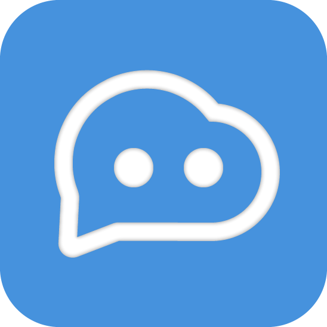

<p align="center">


<div align="center">
<h3>聚焦微信、企业微信、飞书场景的 AI 机器人平台。</h3>
<h4>保留自部署与二次开发能力，去掉无关渠道与外部导向内容，服务实际业务接入。</h4>


</div>

</p>

---

## 项目目的

这个项目不是为了追求“大而全”的多渠道机器人能力，而是围绕当前真实要用的渠道和业务场景做长期维护与持续定制：

- 聚焦 **微信、企业微信、飞书** 三类主要接入场景。
- 重点服务 **企业微信对外客服**、微信生态消息处理和内部协同场景。
- 去掉当前不用的渠道、演示入口和外部导向链接，降低维护成本与运行负担。
- 保留 **Web 管理界面、插件扩展、知识库 / RAG、模型接入能力**，方便继续按业务需求演进。

---

## 当前保留能力

- **渠道能力**：微信、企业微信、飞书。
- **模型接入**：支持主流大模型、聚合平台和本地模型接入。
- **知识库能力**：支持 RAG、工作流编排与常见 LLMOps 集成。
- **管理界面**：通过 Web 面板完成配置、管理和运行监控。
- **扩展方式**：保留插件化扩展与后续二次开发空间。

---

## 快速开始

### 一键启动

```bash
uvx langbot
```

> 需要先安装 [uv](https://docs.astral.sh/uv/getting-started/installation/)，启动后访问 `http://localhost:5300`。

### Docker Compose

```bash
git clone https://github.com/1776686596/copy_dkd LangBot
cd LangBot/docker
docker compose up -d
```

---

## 当前保留渠道

| 渠道 | 状态 | 说明 |
|------|------|------|
| 微信 | ✅ | 个人微信、公众号相关场景 |
| 企业微信 | ✅ | 应用消息、对外客服、智能机器人 |
| 飞书 | ✅ | 企业协作消息与机器人接入 |

---

## 适用场景

| 场景 | 说明 |
|------|------|
| 客服接待 | 通过企业微信对外客服接入 AI，应答常见咨询与业务问题 |
| 内部协同 | 在飞书、企业微信中承接知识问答、流程辅助与通知触达 |
| 微信运营 | 将 AI 能力接入微信生态，用于内容问答、自动回复和业务连接 |
| 私有化部署 | 在自己的环境中部署、配置和持续定制，而不是依赖外部托管平台 |

---

## 说明

- 本仓库当前只保留中文主 README。
- 文档与说明会优先围绕当前实际保留的渠道和部署方式维护。

<!--
## For Code Agents

If you're a code agent based on LLM, you should read [AGENTS.md](AGENTS.md) to understand the project structure and development process before you start any development.
-->
